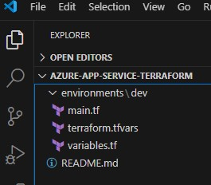

# COPILOT for SRE's and DevOps
This repo is created for GitHub Copilot Adoption Program, specifically for DevOps and SRE Hands On!

# First Activity: Create your Workspace and Project with VS Code and Terraform

- VS Code and Terraform

## Objectives

- Create Terraform project using GitHub Copilot from a Scratch.



## Requirements

- VS Code
- GitHub Copilot license
- GitHub Copilot Extension
- GIT CLI
- GitHub Copilot CLI Extension
- VS Speech Extension
- Terraform Extension

## Step 1: Create a Terraform Project

> @workspace /new create folders and files structures to provision an Azure App Service with terraform over one environment: DEV. All this using the Terraform Azure Provider.

- Click on Create Workspace.

### Troubleshooting

- The ".tf" files could be different because we are working with gen-ai, if you have problems use bellow ones.

- main.tf
```terraform
# We strongly recommend using the required_providers block to set the
# Azure Provider source and version being used
terraform {
  required_providers {
    azurerm = {
      source  = "hashicorp/azurerm"
      version = "=3.0.0"
    }
  }
}

# Configure the Microsoft Azure Provider
provider "azurerm" {
  skip_provider_registration = true # This is only required when the User, Service Principal, or Identity running Terraform lacks the permissions to register Azure Resource Providers.
  features {}
}

# Resource group
resource "azurerm_resource_group" "dev" {
  name     = var.resource_group_name
  location = var.location
}

# App service plan
resource "azurerm_app_service_plan" "dev" {
  name                = var.app_service_plan_name
  location            = azurerm_resource_group.dev.location
  resource_group_name = azurerm_resource_group.dev.name
  sku {
    tier = "Standard"
    size = "S1"
  }
}

# App service
resource "azurerm_app_service" "dev" {
  name                = var.app_service_name
  location            = azurerm_resource_group.dev.location
  resource_group_name = azurerm_resource_group.dev.name
  app_service_plan_id = azurerm_app_service_plan.dev.id

  site_config {
    dotnet_framework_version = "v5.0"
    scm_type                 = "LocalGit"
  }
}

# Create an Azure Storage Account
resource "azurerm_storage_account" "dev" {
  name                     = var.storage_account_name
  resource_group_name      = azurerm_resource_group.dev.name
  location                 = azurerm_resource_group.dev.location
  account_tier             = "Standard"
  account_replication_type = "LRS"
}
```

- variables.tf
```terraform
# Input variables for the DEV environment

variable "resource_group_name" {
  description = "The name of the resource group for the DEV environment"
  type        = string
}

variable "app_service_name" {
  description = "The name of the Azure App Service for the DEV environment"
  type        = string
}

variable "app_service_plan_name" {
  description = "The name of the Azure App Service Plan for the DEV environment"
  type        = string
}

variable "storage_account_name" {
  description = "The name of the Azure Storage Account for the DEV environment"
  type        = string
}

variable "location" {
  description = "The Azure region for the DEV environment"
  type        = string
}
```

- terraform.tfvars
```terraform
# Azure Resource Group Name
resource_group_name = "dev-resource-group-traid"

# Azure App Service Name
app_service_name = "dev-app-service-traid"

# Azure App Service Plan Name
app_service_plan_name = "dev-app-service-plan-traid"

# Azure Storage Account Name
storage_account_name = "devstorageaccounttraid"

# Azure Region
location = "West US"
```

## Step 2: Ask Copilot Chat to generate the workspace doco

> @workspace create a README.md Markdown file that document all functions, files and folders.

- Check the generated Markdown File and create a new file with the suggestion

## Step 3: Ask Copilot Chat how can I start my deployment to Azure

> How can I initialize the Terraform configuration for my Azure App Service deployment?

- CHeck Copilot Chat suggestion and try to follow the steps.

## Step 4: Using Comment Driven Development (CDD) ask Copilot to create an Storage Account

> Create an Azure Storage Account using Terraform azurerm provider.

## Step 5: On the "Terminal" try to perform a Terraform Init, Plan and Apply.

> terraform init

## Step 6: On the "Terminal" ask Copilot to explain any of the Terraform commands and read the answer.

> gh copilot explain "Terraform init"

## Step 7: Ask Copilot Chat to generate an Azure DevOps Pipeline to deploy my Terraform scripts.

> @workspace Please generate an Azure DevOps Pipeline ".yaml" in order to execute and deploy infrastructure with the files used here as reference.

