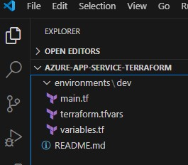

# COPILOT para SRE's and DevOps
Este repositorio está creado para el Programa de Adopción de GitHub Copilot, específicamente para DevOps y SRE Hands On!

# Primera Actividad: Crea tu Espacio de Trabajo y Proyecto con VS Code y Terraform

- VS Code y Terraform

## Objetivos

- Crear un proyecto de Terraform usando GitHub Copilot desde cero.



## Requerimientos

- VS Code
- Licencia de GitHub Copilot
- Extensión de GitHub Copilot
- GIT CLI
- Extensión de GitHub Copilot CLI
- Extensión de VS Speech
- Extensión de Terraform

## Paso 1: Crear un Proyecto de Terraform

> @workspace /new crear estructuras de carpetas y archivos para aprovisionar un Azure App Service con terraform en un entorno: DEV. Todo esto usando el Terraform Azure Provider.

- Haz clic en Crear Espacio de Trabajo.

### Solución de Problemas

- Los archivos ".tf" podrían ser diferentes porque estamos trabajando con gen-ai, si tienes problemas usa los siguientes:

- main.tf
```terraform
# Recomendamos encarecidamente usar el bloque required_providers para establecer la
# fuente y versión del Azure Provider que se está utilizando
terraform {
 required_providers {
 azurerm = {
 source = "hashicorp/azurerm"
 version = "=3.0.0"
 }
 }
}
# Configurar el Microsoft Azure Provider
provider "azurerm" {
 skip_provider_registration = true # Esto solo es necesario cuando el Usuario, Principal de Servicio o Identidad que ejecuta Terraform no tiene permisos para registrar Proveedores de Recursos de Azure.
 features {}
}
# Grupo de recursos
resource "azurerm_resource_group" "dev" {
 name = var.resource_group_name
 location = var.location
}
# Plan de servicio de aplicaciones
resource "azurerm_app_service_plan" "dev" {
 name = var.app_service_plan_name
 location = azurerm_resource_group.dev.location
 resource_group_name = azurerm_resource_group.dev.name
 sku {
 tier = "Standard"
 size = "S1"
 }
}
# Servicio de aplicaciones
resource "azurerm_app_service" "dev" {
 name = var.app_service_name
 location = azurerm_resource_group.dev.location
 resource_group_name = azurerm_resource_group.dev.name
 app_service_plan_id = azurerm_app_service_plan.dev.id
 site_config {
 dotnet_framework_version = "v5.0"
 scm_type = "LocalGit"
 }
}
# Crear una Cuenta de Almacenamiento de Azure
resource "azurerm_storage_account" "dev" {
 name = var.storage_account_name
 resource_group_name = azurerm_resource_group.dev.name
 location = azurerm_resource_group.dev.location
 account_tier = "Standard"
 account_replication_type = "LRS"
}
```

- variables.tf
```terraform
# Variables de entrada para el entorno DEV
variable "resource_group_name" {
 description = "El nombre del grupo de recursos para el entorno DEV"
 type = string
}
variable "app_service_name" {
 description = "El nombre del Azure App Service para el entorno DEV"
 type = string
}
variable "app_service_plan_name" {
 description = "El nombre del Azure App Service Plan para el entorno DEV"
 type = string
}
variable "storage_account_name" {
 description = "El nombre de la Cuenta de Almacenamiento de Azure para el entorno DEV"
 type = string
}
variable "location" {
 description = "La región de Azure para el entorno DEV"
 type = string
}
```

- terraform.tfvars
```terraform
# Nombre del Grupo de Recursos de Azure
resource_group_name = "dev-resource-group-traid"
# Nombre del Azure App Service
app_service_name = "dev-app-service-traid"
# Nombre del Azure App Service Plan
app_service_plan_name = "dev-app-service-plan-traid"
# Nombre de la Cuenta de Almacenamiento de Azure
storage_account_name = "devstorageaccounttraid"
# Región de Azure
location = "West US"
```

## Paso 2: Pregunta a Copilot Chat para generar la documentación del espacio de trabajo

> @workspace crea un archivo README.md en Markdown que documente todas las funciones, archivos y carpetas.

- Revisa el archivo Markdown generado y crea un nuevo archivo con la sugerencia.

## Paso 3: Pregunta a Copilot Chat cómo puedo iniciar mi despliegue en Azure

> ¿Cómo puedo inicializar la configuración de Terraform para mi despliegue de Azure App Service?

- Revisa la sugerencia de Copilot Chat y trata de seguir los pasos.

## Paso 4: Usando Comment Driven Development (CDD) pide a Copilot que cree una Cuenta de Almacenamiento

> Crea una Cuenta de Almacenamiento de Azure usando el proveedor azurerm de Terraform.

## Paso 5: En el "Terminal" intenta realizar un Terraform Init, Plan y Apply.

> terraform init

## Paso 6: En el "Terminal" pide a Copilot que explique alguno de los comandos de Terraform y lee la respuesta.

> gh copilot explain "Terraform init"

## Paso 7: Pregunta a Copilot Chat para generar un Pipeline de Azure DevOps para desplegar mis scripts de Terraform..

> @workspace Por favor genera un Pipeline de Azure DevOps ".yaml" para ejecutar y desplegar infraestructura con los archivos usados aquí como referencia.
